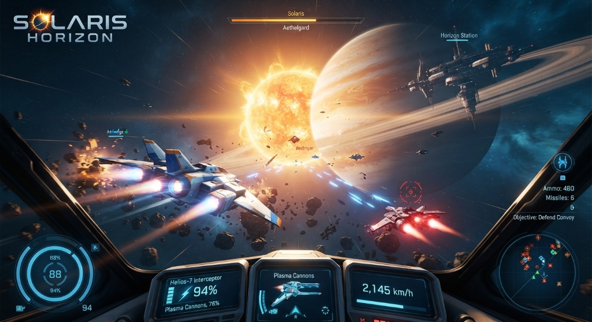

# 🌌 Solaris Horizon: Emergence — 3D Space Game Concept & Prototype


An action-packed 3D space warfare, exploration, and flight simulation game.



## 🚀 Overview

**Solaris Horizon: Emergence** combines high-speed 6-DOF fighter dogfighting, massive capital ship fleet warfare, and a wormhole highway network with a deep narrative.

### 📖 Story Premise
You start as a fighter pilot for the **United Earth Space Force (UESF)** patrolling outer Sol system mining corridors. Raised on an orbital colony by an adoptive parent with only an unknown titanium-crystal pendant, your life changes when a rogue alien attack triggers a dormant **Precursor Wormhole Gate**.

Pulled thousands of lightyears away into the **Sovereign Reach**, precursor ruins recognize your genetic signature: you are the last surviving bloodline heir to **House Aethelgard**, overthrown 20 years ago by an aggressive military junta known as **The Iron Dominion**.

---

## 🎮 Features & Gameplay Pillars

- **6-DOF Dogfighting**: High-speed maneuvering, afterburner boosting, pulse plasma blasters, and energy routing (*Weapons vs. Shields vs. Engines*).
- **Capital Ship Fleet Warfare**: Dogfight around colossal Titan Battlecruisers, disabling subsystem turrets and shield generators.
- **Wormhole Highway Network**: Transit between star sectors via stable jump gates or explore unstable anomalies containing precursor relics.
- **Action Pacing**: Low politics, high-octane space combat, mission briefings, and fleet command operations.

---

## 🛠️ Project Structure

```
spacegame/
├── index.html                  # Playable 3D WebGL Space Flight Prototype & Concept Hub
├── docs/
│   └── game_design_document.md # Detailed Game Design Document (GDD)
└── README.md                   # Project overview & quickstart
```

---

## 🌐 Running the 3D Prototype Locally

You can launch the self-contained 3D space flight prototype locally using any HTTP web server (e.g. Python):

```bash
# Navigate to project directory
cd D:\github\spacegame

# Start local server
python -m http.server 8088
```

Open `http://localhost:8088` in your web browser to play the 3D flight demo, spawn enemy interceptors, jump through wormholes, and view ship class specifications.

---

## 📑 Game Design Document

For complete lore breakdown, ship class specifications, campaign acts, and technical engine recommendations (Unreal Engine 5 vs Unity vs Godot 4), see [`docs/game_design_document.md`](docs/game_design_document.md).
