# Solaris Horizon: Emergence - Narrative Arc & Campaign Structure

## 📖 Overview
From Earth Defense Force Cadet to Sovereign Royal Scion. Action-driven pacing with low politics and high space warfare.

---

## 🎭 The Campaign Arc

### ACT I: THE EARTH CADET

**Prologue — Sol System & The Crest**

The year is 2244. Kaylen Vance begins his journey as an interceptor pilot in the Earth Defense Force (EDF). For as long as he can remember, his existence has been tethered to 'The Crest,' an orbital platform that hovers like a silver coin in the desolate trade corridors between Jupiter and Neptune. Life here is a masterclass in sensory deprivation, punctuated only by the klaxons of incoming ore freighters and the low hum of the station’s failing fusion reactors. The Crest is a masterwork of utilitarian engineering—a citadel of steel, warning lights, and rotating habitation rings that cast long shadows across the moons of the outer system.

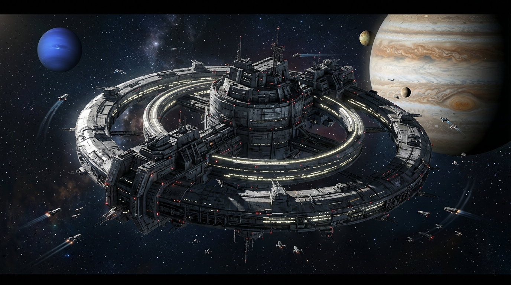

Walking the corridors of The Crest, Kaylen is constantly assaulted by the smells of ozone, recycled air that tastes like pennies, and engine grease. The personnel here are hardened pilots who have traded the skies of Earth for a meager paycheck in the dark. He has spent countless hours in simulator runs, mastering zero-G maneuvers until his hands bleed and his vision blurs. The military bureaucracy is stifling, reducing every act of bravery to a form in triplicate. His only action comes in the form of skirmishes with desperate asteroid miners who have turned to piracy out of necessity, their patchwork ships easy prey for his interceptor. Yet, even as he outmaneuvers them, pulling high-G turns that leave other pilots blacking out, he feels no thrill of victory. He is a ghost in a machine, going through the motions.

This sense of alienation stems from a past shrouded in rusted metal and red dust. Kaylen was raised in the rust-stained slums of Mars by Elias. Elias was a gruff EDF mechanic who treated the boy like his own flesh and blood, despite his mysterious origins. His garage was a labyrinth of cannibalized fusion drives and plasma coils, a haven of sparks amidst the poverty of the Martian undercity. Elias taught Kaylen ayrospace mechanics. He showed the young pilot how to bypass fusion limiters with a copper wire, how to hotwire ignition coils before he could read a technical manual, and how to listen to the rhythm of an engine to diagnose a misfire.

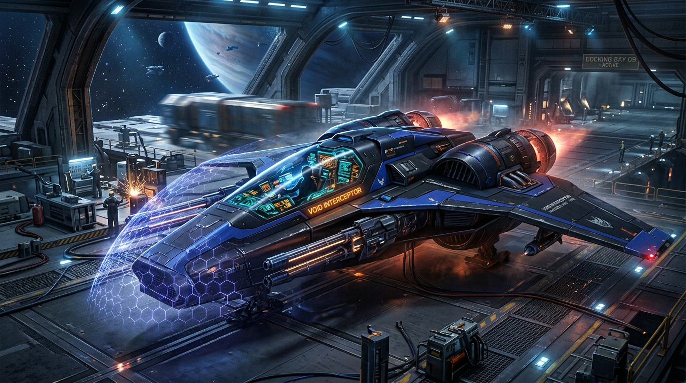

Elias is a man who speaks little of the past. His lungs are scarred by decades of inhaling thruster exhaust, resulting in a rattling cough that punctuates his rare moments of laughter. But his loyalty to Kaylen is unwavering. He is the anchor that keeps Kaylen tethered to reality, the only father he has ever known. Despite his unspoken love, Kaylen has always felt a maddening disconnect from him, from Mars, and from the rest of humanity. He is plagued by vivid recurring dreams. In his sleep, he stands beneath twin suns he has never seen, casting shadows across cities of golden glass that do not exist anywhere in the Sol System. He hears a woman's voice, melodic and sad, singing a lullaby in a complex language that his brain understands perfectly, even if his waking mind cannot translate it.

His only link to this past is a glowing pendant. Elias found it with him twenty years ago. Kaylen was just an infant, clutching the artifact in his hands inside a shielded escape pod drifting near the Kuiper Belt. The metal of the pod was unknown to Earth scientists—a self-repairing alloy that drank the light and resisted all attempts at laser-cutting, acid baths, or chemical analysis. The pendant hums with a warm energy signature that defies known laws of thermodynamics, vibrating in his palm when pointed toward the galactic center. Elias, recognizing the danger of such an anomaly, hid the pod beneath the Martian surface and concealed the pendant's nature. He called in favors with corrupt contacts to register Kaylen as a Martian refugee, keeping him safely off the radar of EDF intelligence.

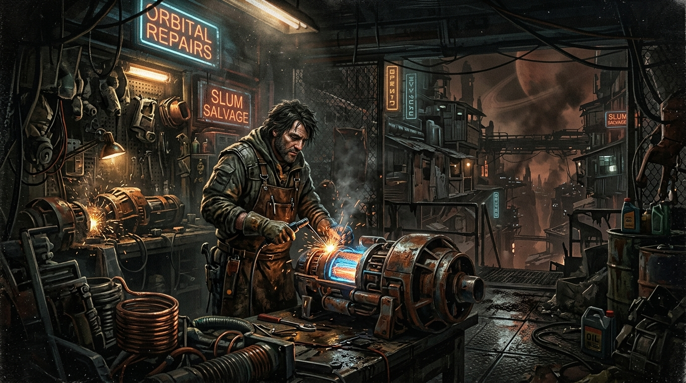

But the secrets of his past can only remain buried for so long. Life on The Crest remains a cycle of perimeter patrols and maintenance until a Tuesday shift that changes the trajectory of the universe.

Kaylen sits in the cockpit of his Void Interceptor, running pre-flight checks. The dogfighting mechanics of these ships require synergy between pilot and machine. He must balance the energy distribution across three vital systems: the kinetic shields, the fusion engines, and the railgun blasters. Divert too much power to the shields, and he becomes a sitting duck; pump it all into the engines, and a single micrometeorite will tear through his hull. He grips the dual flight sticks, feeling the resistance of the controls. His HUD flickers to life, painting the void with tactical overlays, target locks, and vector projections.

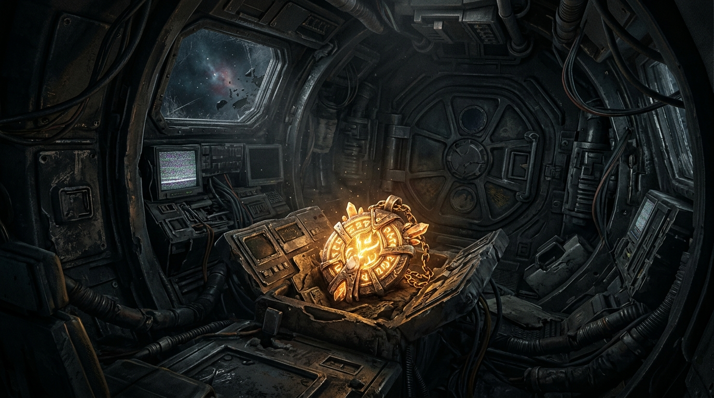

Without warning, the stars outside the station warp in a display of gravitational lensing. A Dominion raiding fleet drops out of slipspace directly over Titan's thin atmosphere. Their arrival doesn't register on the EDF's tachyon scanners until it is too late; they simply tear a hole in reality and pour through. Their ships are jagged wedges of dark metal, adorned with crimson thrusters that look like bleeding wounds in the void.

Wielding dark-energy beam weapons and plasma plating, the Dominion vanguard tears through the EDF perimeter patrols in seconds. The silence of space is abruptly replaced by the panicked chatter of the EDF comms network. Kaylen hears the screams of veteran pilots as their interceptors are sheared in half by beams of violet energy. Entire squadrons are wiped from the tactical grid in the blink of an eye, their icons turning from green to gray.

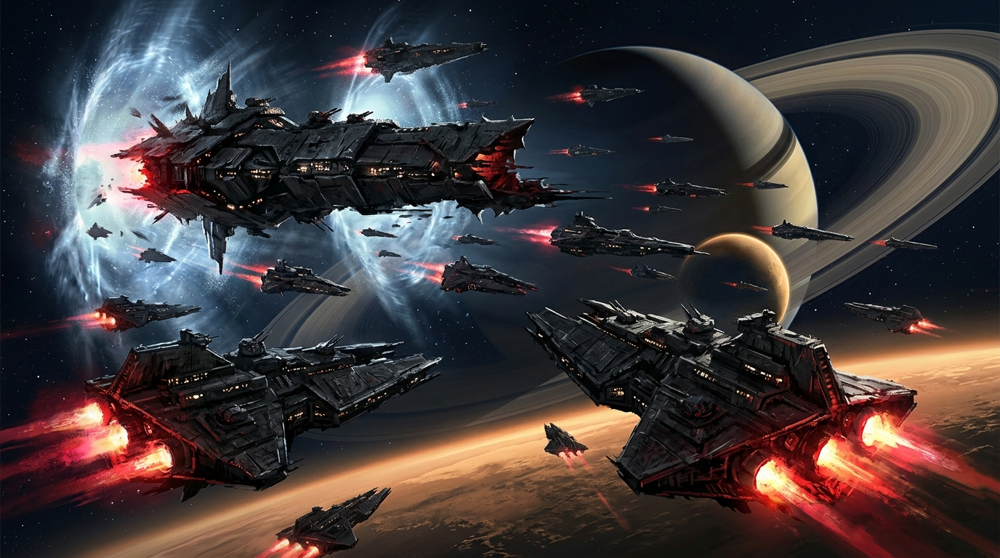

Kaylen launches from The Crest’s catapult, pinned to his seat by acceleration, and dives into the fray. He quickly realizes the Dominion aren't here to conquer Sol or strip-mine its resources; they possess technology beyond the need for fusion fuel. They are here for a specific target. Their dreadnoughts ignore the EDF cruisers and begin bombarding the methane lakes of Titan. Their dark-energy beams melt through kilometers of crust in seconds, boiling the methane into vapor to reveal an ancient wormhole gate. It is an artifact humanity never knew existed, a ring of etched metal the size of a moon, buried for millions of years beneath the ice.

The Earth Defense Force scrambles its cruisers to respond, ordering a concentrated alpha strike. The human ships unleash a barrage of kinetic railguns and fusion missiles. But the payload proves completely useless. The tungsten slugs and nuclear warheads bounce off the Dominion's hexagonal shielding, detonating in useless fireballs that merely illuminate the enemy hulls.

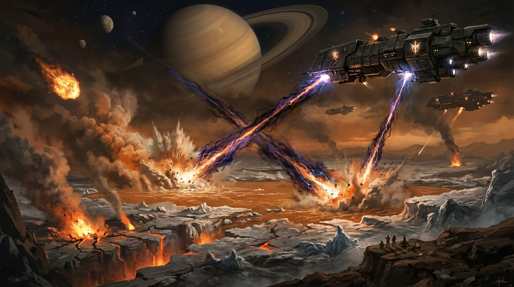

The EDF capital ships are brutally ripped apart by Dominion gravity-shears. Waves of crushed space-time fold the human cruisers in half, rupturing their fusion cores and scattering their wreckage across Titan's orbit. This leaves only the agile interceptor squadrons to weave through the burning debris field and mount a futile defense. The battle is a massacre. Kaylen pushes his Void Interceptor to its limits, manually bypassing the safety limiters just as Elias taught him. He toggles his power distribution wildly, shunting energy to the port shields to deflect a glancing blow from a dark-energy beam, then throwing it all into the engines to perform a zero-G drift around the husk of a destroyed cruiser.

He locks onto a Dominion fighter, his railguns spooling up. He squeezes the trigger, sending a stream of tungsten slugs into the enemy ship's thruster bell, the only unshielded weak point. The enemy fighter spins out of control and detonates, but for every one he destroys, ten more drop from the dreadnoughts' bays. Kaylen watches helplessly as his wingmen are disintegrated, their comms cutting out mid-scream.

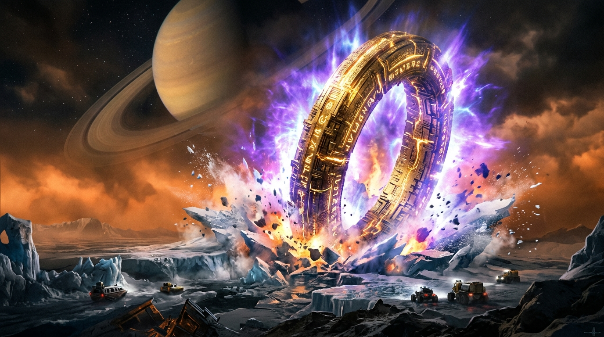

Beneath him, the precursor ring beneath Titan activates. It bursts through the boiling ice in a halo of violet light. The energy output creates a gravitational shear that reaches all the way to The Crest. Through his canopy, Kaylen watches in horror as the orbital platform begins tearing apart. Steel bulkheads groan and buckle, habitation rings snap off like cheap toys, and atmosphere vents violently into the void in freezing geysers. Thousands of EDF personnel, comrades he shared coffee and jokes with, are carried out into the vacuum, their silhouettes tumbling into the dark.

Seeing his squadron decimated, the station falling, and the collapsing gravity well of the active wormhole threatening to swallow the sector, Kaylen makes a suicidal decision. He realizes Earth's only hope of survival is to close the gate from the inside before the bulk of the Dominion armada can cross the threshold. The dreadnoughts are already maneuvering toward the rift, preparing to bring their planet-cracking weapons to bear on Earth.

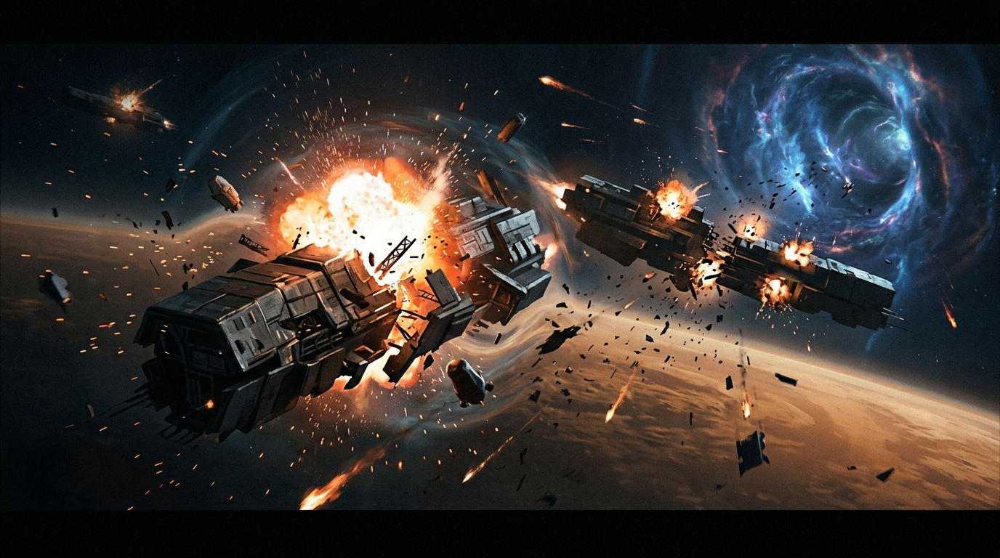

He diverts auxiliary power to his Void Interceptor's thrusters. He rips the limiter switch from the console, pushing the reactor into the red, and ignoring the warning lights illuminating his cockpit in panic. He pushes the g-force limits of his ship and his own body, the blood draining from his head, blacking out the edges of his vision until all he can see is the violet vortex of the wormhole.

As he dives toward the gate, dodging anti-aircraft fire from the Dominion dreadnoughts, the comms crackle to life. It is Elias. He is broadcasting on a hyper-wave frequency, bypassing the jammed channels. He is begging Kaylen to turn back, his gruff voice breaking through the static in a display of raw emotion. Kaylen can hear the rattling cough and panic in his breath.

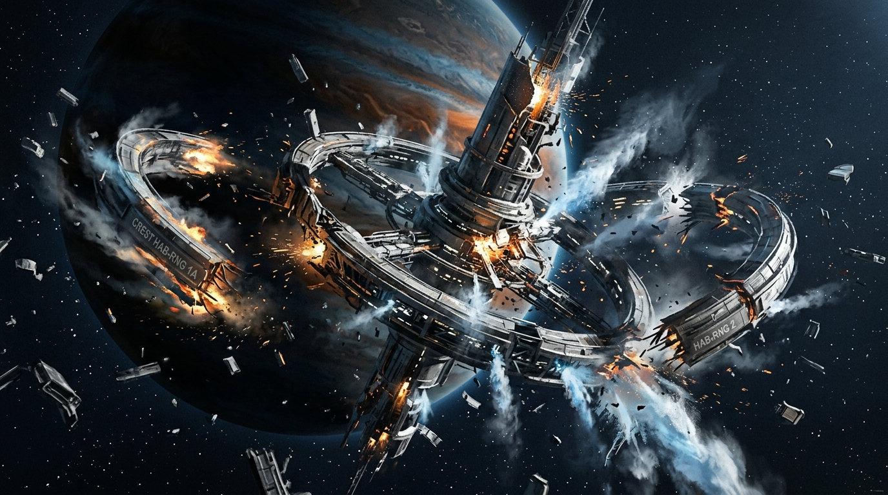

"Kaylen, no! You can't take that ship in there! The shear will tear you apart! Come back, son!"

Tears streak Kaylen's face, floating in the microgravity of the cockpit. He locks his flight stick forward, the g-forces pinning his hand in place. He takes a deep breath, looking down at the glowing pendant on his chest. It is pulsing, resonating with the frequency of the open gate.

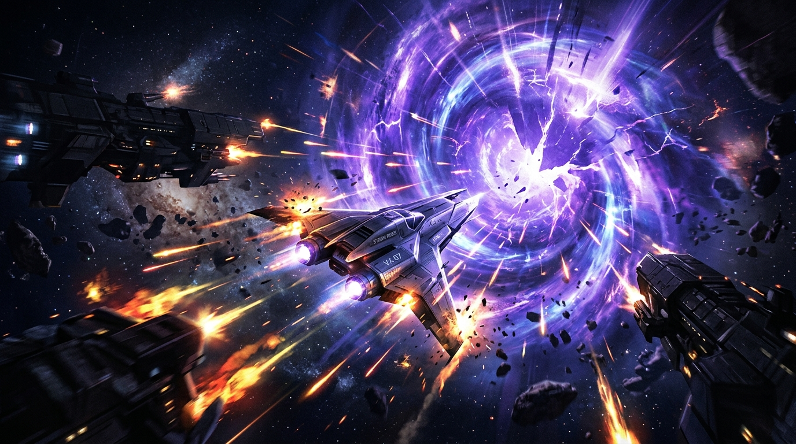

"Someone has to shut the door, old man," Kaylen whispers into the mic, his voice steady despite the chaos. "I love you. Goodbye."

He plunges into the collapsing rift, drawing the enemy's fire, providing the seconds needed for his remaining wingmen to scatter and escape. The energy of the gate washes over his ship, stripping away the outer hull plating. The wormhole implodes behind him in a shockwave of exotic matter, sealing the Sol System away from the Dominion's grasp. Earth is saved, but Kaylen is thrown into the chaotic currents of subspace, trapped on the other side of the universe, hurtling toward a destiny he was born to fulfill.

### ACT II: THE VERDANT REACH

Expelled from the chaotic subspace currents of the collapsing wormhole, Kaylen Vance slammed back into real-space with bone-jarring force. The transition from the sterile void of the Sol System to this new sector was a sensory overload. Outside his shattered canopy, the sky was a canvas of luminescent nebulas—vibrant ribbons of pink and green, interwoven with rogue asteroid clusters that drifted like forgotten debris of creation. This was the Sovereign Reach, an uncharted expanse thousands of light-years from Earth, and it was deadly.

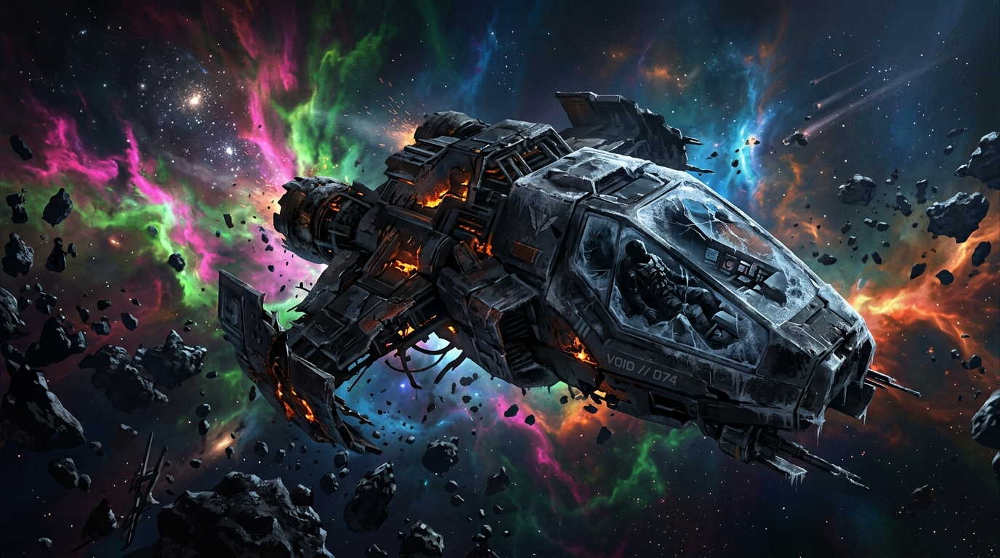

His Void Interceptor was a floating coffin. Damage alarms wailed in a symphony of imminent death, the life support system was failing, and the fusion reactor had drained in the sprint to seal the Titan gate. Frost crept across the edges of the cockpit glass, and the cold of the void began to seep through Kaylen's flight suit. He was drifting toward the corona of a harsh star, his breath crystallizing in the failing atmosphere.

Just as the edges of his vision began to darken, a violent jolt rocked the Interceptor. An azure tractor beam locked onto his ruined hull, halting its descent toward the star. Kaylen watched through half-lidded eyes as the rust-colored silhouette of a salvage vessel eclipsed the starlight, pulling him from the jaws of the void.

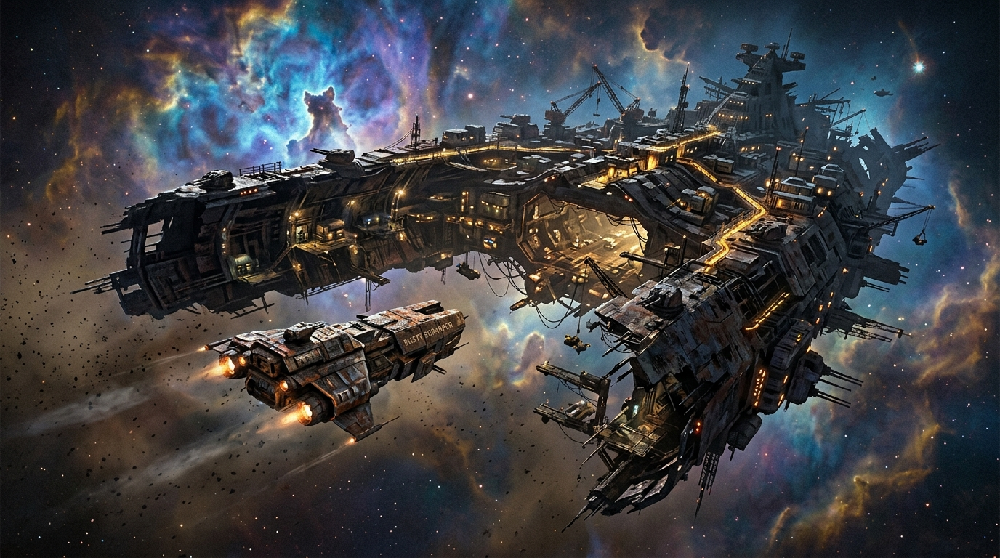

He awoke hours later in the sterile medical bay of the scavenger ship, his wounds hastily patched. When he staggered to the observation deck, the sight before him stole the breath he had regained. The salvage vessel was docking at an independent outpost known as 'The Rust Haven'. It wasn't a space station; it was the hollowed-out carcass of a precursor dreadnought, a leviathan of metal suspended in cosmic dust.

The Rust Haven was a chaotic hive of scum and villainy, built into the ribbed infrastructure of the ancient warship. It was a neon-lit maze of cantinas, chop shops, and black markets. Armed local warlords rubbed shoulders with disgraced politicians in the shadows, while synthetic units traded encrypted data drives for coolant. The air in the hangar bays tasted of sulfur, synthehol, and the static charge of unshielded plasma cutters.

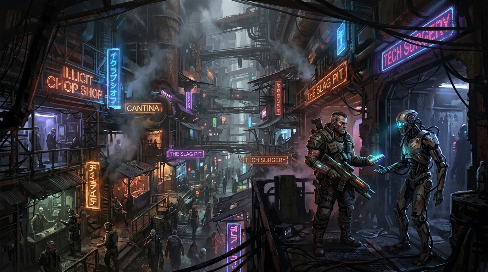

To survive in this unforgiving frontier, Kaylen had to make a choice. He was no longer an Earth Defense Force cadet; he was a ghost in a galaxy that didn't care if he lived or died. With a heavy heart, he stripped his EDF insignias from his flight suit and repainted his Interceptor's hull in matte grays. He dove headfirst into the underworld of mercenary warfare, knowing that out here, loyalty was bought with plasma fuel and survival belonged only to the ruthless.

His first contracts were acts of desperation. Rival factions, criminal syndicates, and corporate barons controlled the Reach, and Kaylen offered his piloting skills to the highest bidder. He took on dangerous jobs that seasoned mercenaries wouldn't touch. One week, he was escorting freighter convoys through pirate-infested asteroid belts, his Interceptor weaving between monolithic rocks to pick off ambushers. The next, he was flying into volatile nebulas to raid hidden smuggler strongholds for contraband circuitry.

He learned the art of the ambush, shedding the rigid doctrines of the EDF to adapt to the void. He mastered the maneuver of hiding his ship's heat signature within the corona of dying stars, striking out at bounties before vanishing back into the flames. He learned to salvage alien tech from the derelict capital ships from forgotten wars that littered the fringes of the sector.

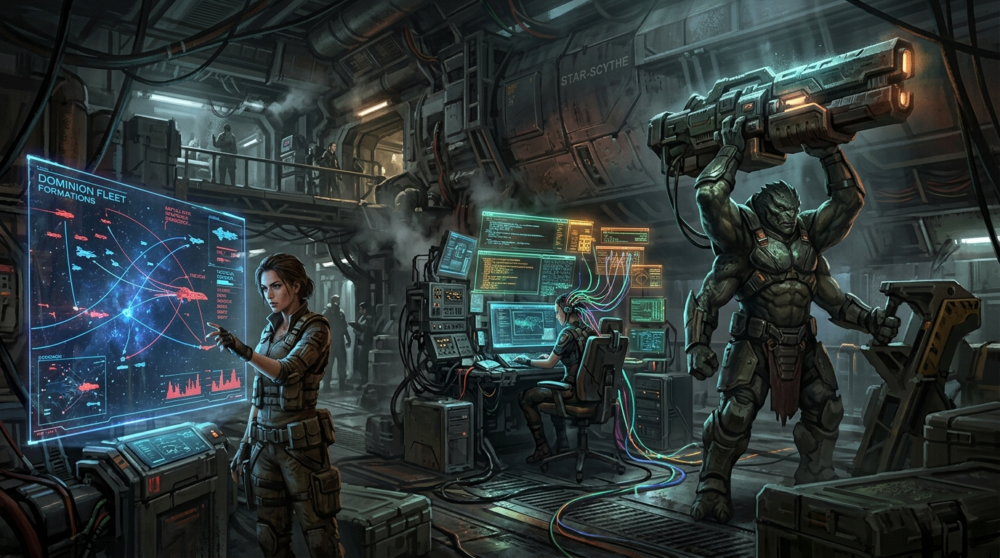

His tactics evolved. Kaylen learned to rely on stealth, speed, and environmental hazards rather than sheer firepower. He would lure pirate galleons into gas clouds, shooting pockets of methane to disintegrate his pursuers in localized supernovas. When outgunned by missile swarms, he utilized the gravitational pull of micro black holes, slingshotting his Interceptor at incredible speeds to outrun the weapons designed to annihilate him.

But a pilot is only as good as his crew, and The Rust Haven was the perfect place to assemble a family of outcasts. His first recruit was Jax, a cynical hacker whom Kaylen rescued from a warlord's torture rack. Jax was a living wire, constantly jacked into data streams. Operating from the shadows of Kaylen’s modified cargo freighter—which served as their mobile base—Jax handled ship sub-systems, deployed electronic countermeasures, and sliced into enemy communications grids with ease, turning their automated turrets against them.

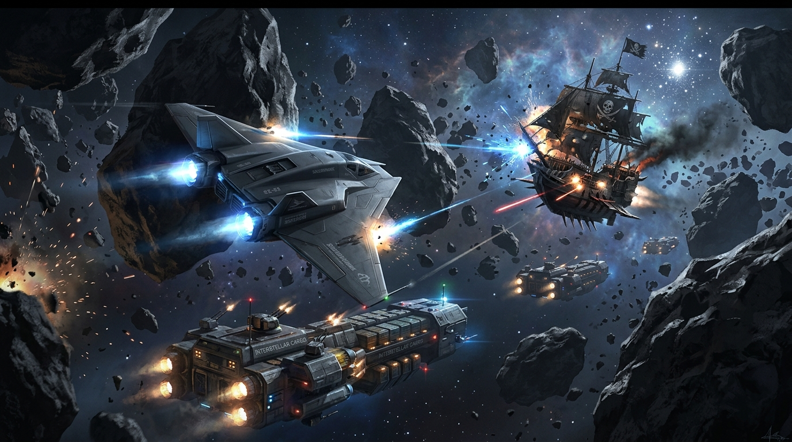

Then came Kayl, a four-armed alien weapons specialist whom Kaylen won in a game of Sabacc. Kayl was a mountain of muscle and scaled flesh, serving as both the freighter’s gunner and chief mechanic. He possessed a calm in battle, capable of dead-lifting overheated plasma cannons to realign their focusing lenses mid-firefight. Beneath his exterior, Kayl possessed a sense of honor, finding a kindred spirit in the displaced Earth pilot.

The final addition was Lyra, a disgraced tactician seeking redemption. She was a defector from the Iron Dominion—the very empire that had driven Kaylen into the wormhole. Lyra possessed knowledge of Dominion fleet formations, encryptions, and military strategies. Haunted by the war crimes she had facilitated under the tyrant Regent Vaylen, she offered her tactical mind to Kaylen's cause, determined to see her former masters fall.

Together, they transformed the battered Interceptor into a masterpiece of engineering. Their combined expertise allowed Kaylen to customize his fighter, integrating beam weaponry, shield generators, and thruster modifications that made his ship the deadliest strike craft in the Verdant Reach. They were an apex predator unit.

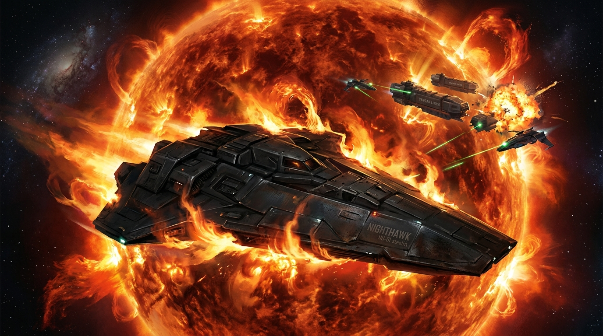

It was during one of these salvage runs that the pendant Kaylen had carried since infancy awoke. The ancient metal began reacting to the environment, pulsing with a rhythmic glow when they approached uncharted coordinates. It acted as a cosmic tuning fork, vibrating with intensity, leading Kaylen away from the trade lanes and into the darkest corners of the sector. 

The pendant guided them to ancient wormhole gates hidden within the cores of dead moons and buried within the crushing atmospheres of gas giants. These precursor structures had laid dormant for millions of years, vast rings of obsidian metal that defied the pressure of their environments. 

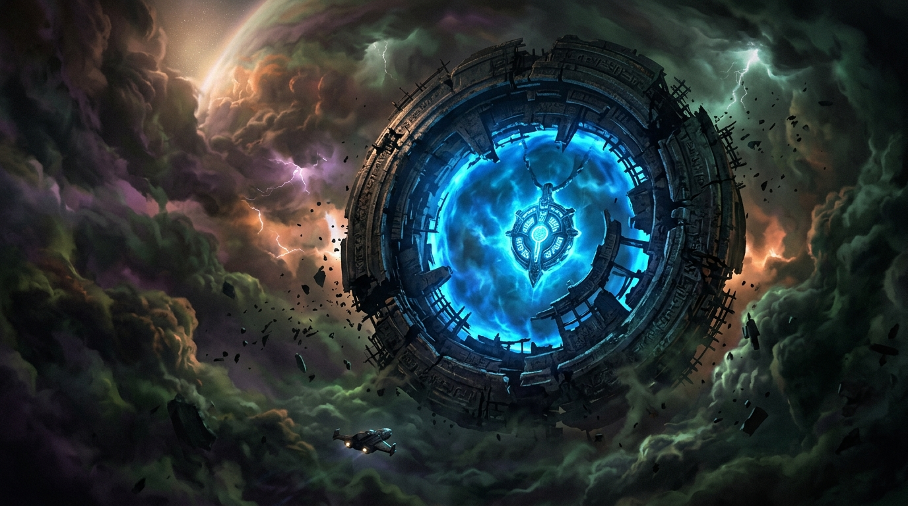

When Kaylen placed the glowing pendant into the central console of the first gate they found, the structure hummed to life, recognizing a genetic signature he didn't know he possessed. The gate didn't open a wormhole; instead, it unlocked a cache of dormant precursor technology, granting Kaylen's ship abilities that defied standard physics and far exceeded anything Earth's engineers had ever dreamed of.

With Kayl and Jax's help, they integrated a teleportation drive into the Interceptor. In combat, it allowed Kaylen to blink across the battlefield. He could jump behind pursuing enemy fighters during a high-speed dogfight, bypassing their shields and causing them to fire upon their own wingmen in the confusion. The sensation of the blink was nauseating—a plunge into a dimension of light and screaming silence—but the tactical advantage was absolute.

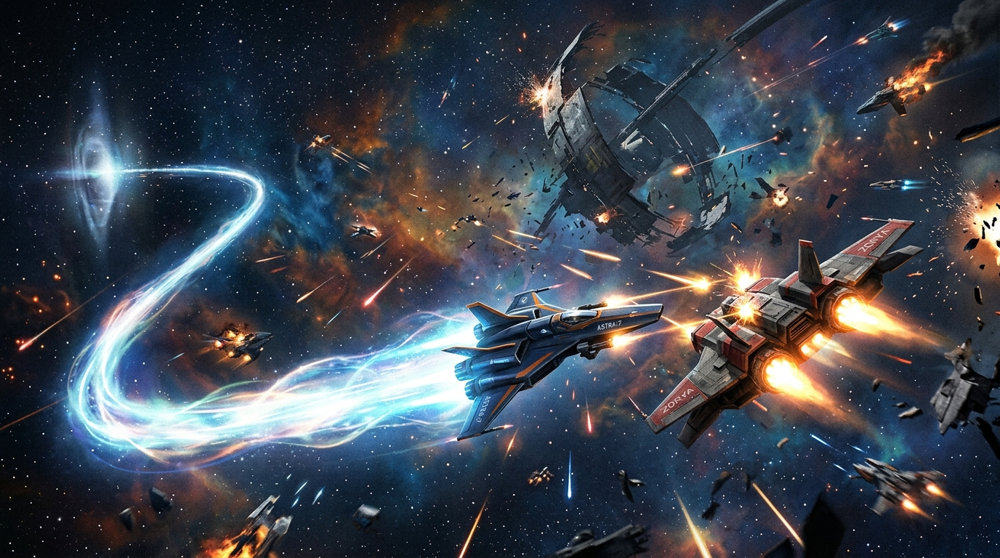

From another ruin, they retrieved the schematics and raw materials for dark-matter torpedoes. These munitions were terrifying in their execution. Upon impact, they didn't just explode; they collapsed the enemy's shields by warping the localized gravity field, creating a micro-singularity that crushed cruiser hulls inward like tin cans before violently detonating. 

The most defensive upgrade was the phase-shifting armor. Tied directly to his neural interface, Kaylen could trigger a shift in the atomic structure of his ship. For three critical seconds, enemy lasers and kinetic rounds would pass harmlessly through his hull, leaving the Interceptor untouched as he dove through anti-aircraft fire that should have vaporized him. 

However, secrets in the Verdant Reach were currency, and currency never stayed hidden for long. Whispers began to spread rapidly among the cantinas, the mercenary guilds, and the bounty hunting syndicates about a pilot from the stars wielding the forbidden "Star Key." Legends spoke of a lost royal bloodline that would one day return to unite the fractured sector and cast down the Iron Dominion. Kaylen's victories and ancient weaponry fueled the fire of these prophecies.

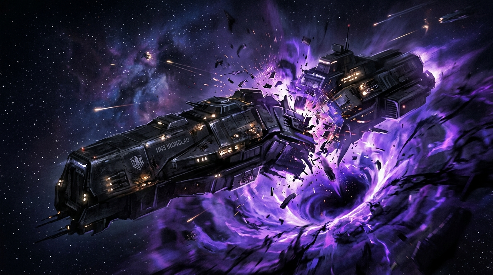

This newfound fame was a double-edged sword. It drew the unwanted attention of local warlords who saw Kaylen not as a savior, but as a walking payday. Bounties were placed on his head, leading to constant ambushes and betrayals by former clients. But the warlords were the least of his concerns. The ripples of his precursor technology had reached the dark corners of the galaxy, alerting the very empire he had fled.

The Iron Dominion had arrived in the Reach. They immediately recognized the energy signatures of the forbidden technology Kaylen wielded. Regent Vaylen, the Dominion's dictator, dispatched his hunter-killer squadrons—fanatical pilots flying dark-energy strike craft—to capture Kaylen dead or alive.

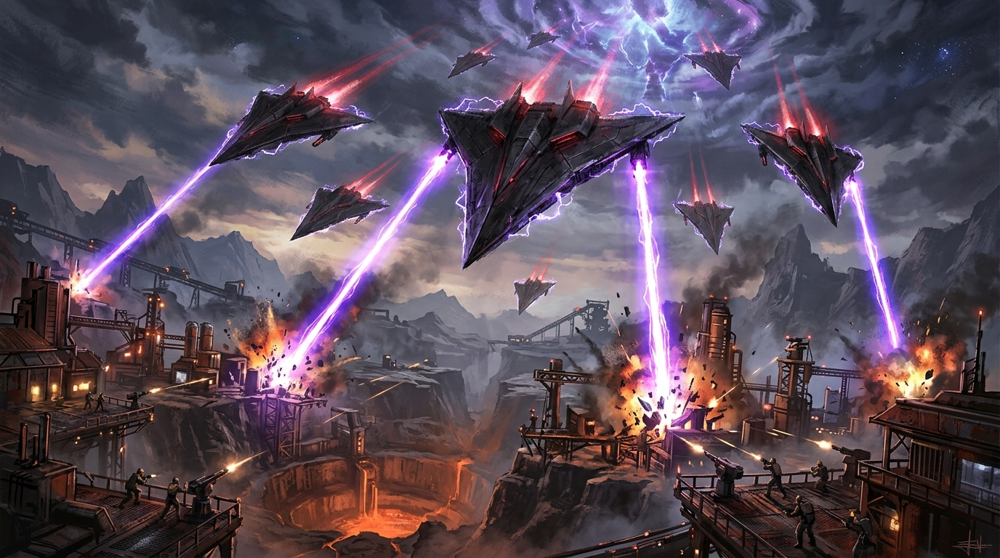

The first encounter with the hunter-killers occurred over a mining colony. They didn't hail, they didn't demand surrender; they simply dropped out of slipspace and opened fire with precision. It was a brutal test of Kaylen's crew and his ancient upgrades. Lyra called out their attack patterns before they formed, Jax scrambled their targeting optics, and Kaylen blinked through their formations, dropping dark-matter torpedoes into their engines. 

They survived, but just barely. As Kaylen's battered freighter jumped to hyperspace, leaving the burning wreckage of the Dominion squadron behind, a realization settled over the crew. They were no longer just struggling to survive in the underworld. The pendant was leading them toward a destiny far larger than a paycheck, and the most powerful military force in the known universe would stop at nothing to see them burn.

### ACT III: THE LOST SCION
**The Truth of the Vanguard Throne**

The deep void of the Tenebris System offered no comfort, only a starless silence that pressed against the viewport of Kaylen's scarred Interceptor. Here, the ancient pendant resting against his chest did not merely hum—it throbbed with a bioluminescent rhythm, casting long azure shadows across the dim cockpit. It had guided Kaylen and his mercenary crew across the breadth of the galaxy, away from the safety of the Rust Haven, plunging them into the uncharted depths of the Nexus. 

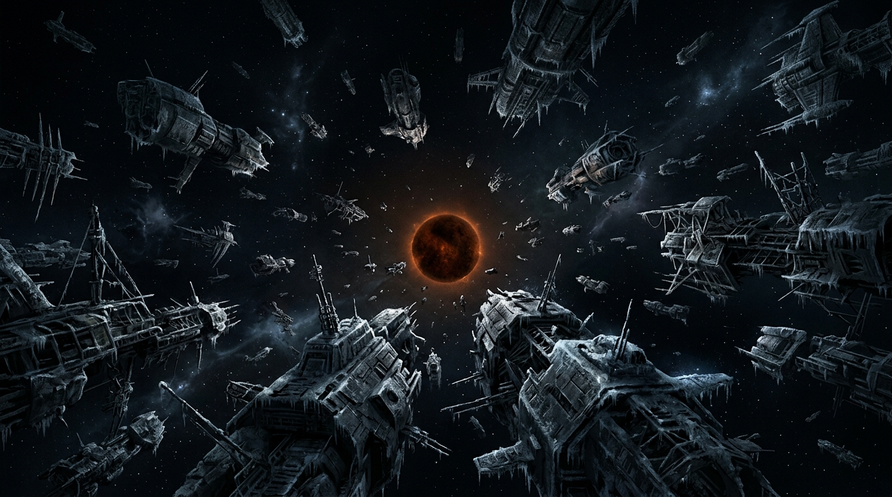

This was the graveyard of empires. Before them floated a dead star, a black dwarf that exerted a complex gravitational pull on the surrounding space. Trapped in its orbit were thousands—perhaps tens of thousands—of petrified vessels. 

They were suspended like insects in amber, frozen in frost. Some were jagged, others sleek, but all had failed to navigate the labyrinthine gravity wells that protected this anomaly. The stillness of this metallic cemetery was chilling to the bone. Kaylen navigated his ship through debris fields of crystallized dreadnoughts and shattered frigates, feeling the ghosts of ancient battles scraping against his hull.

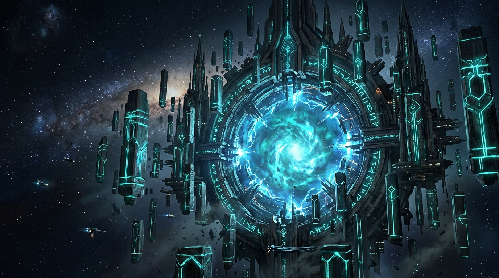

Suddenly, the ship’s navigational computers shrieked in alarm. Red warning lights bathed the cockpit as an invisible force seized the vessel. Manual overrides failed instantly. The engines screamed as they were powered down by an external command. 

A central gate—the heart of the Nexus—emerged from the dark. Its architecture was an arrangement of floating monoliths and glowing energy conduits that defied Euclidean logic. The tractor beam was undeniable, dragging the Interceptor into the central chamber of this cosmic cathedral.

Securing his EVA suit, Kaylen drifted from the airlock into the cavernous chamber. It was completely silent, save for the sound of his own breathing echoing over the comms. The scale was incomprehensible, making him feel no larger than a grain of sand. As he approached the primary console—a floating dais of obsidian glass—the pendant around his neck flared with intensity. 

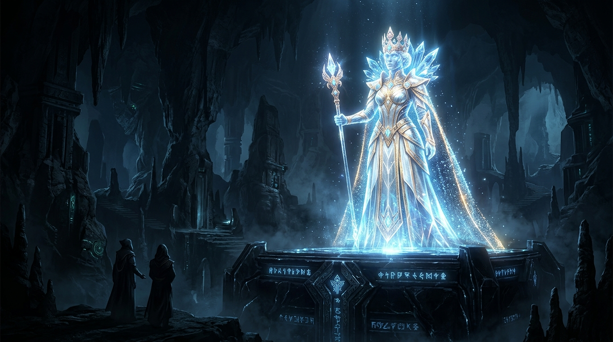

A crimson scan line swept over him, analyzing his genetic signature, diving into the marrow of his bones, recognizing the blood that pulsed in his veins. The chamber erupted to life. The floating monoliths reoriented themselves, projecting a crystalline hologram in the center of the dais. 

It was a woman, clad in regal armor of white and gold. The resemblance was precise; she possessed his exact eyes, the same resolute jawline, the same defiant stance. She was sad and undeniably royal. 

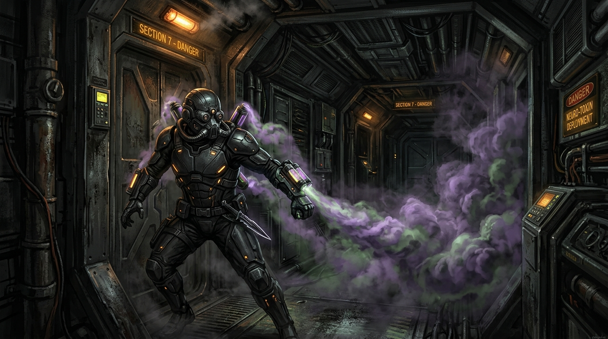

Her voice, carrying the weight of a dying civilization, echoed directly into his helmet. The message she delivered tore down the foundation of his existence. He was not a human orphan scraped from the gutters of a Martian slum. He was the last surviving blood heir to House Vanguard, the benevolent rulers of the Sovereign Reach. 

For centuries, his bloodline had maintained an age of peace and scientific enlightenment, unifying the stars before the darkness fell. The holographic queen detailed the tragedy that had wiped his family from the annals of history. Twenty years ago, the grand Vanguard palaces had burned in a treacherous coup. 

Regent Vaylen, a trusted advisor consumed by ambition and a lust for dark matter, had orchestrated a massacre. The Iron Dominion was born in the fires of House Vanguard’s destruction. Vaylen had usurped the Sovereign throne, enslaved the people in work camps to fuel his war machine, and purged any trace of the Vanguard lineage. 

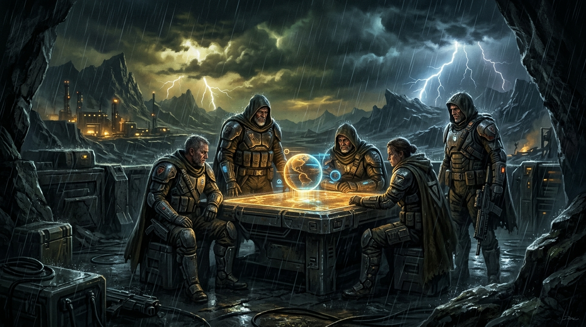

His mother, bleeding and surrounded by enemies, had placed Kaylen into a shielded escape pod in her final moments. She launched him into an ancient wormhole network, praying the cosmic currents would carry him far from Vaylen’s wrath. He was delivered to the uncharted Sol System, hidden among humanity, raised by an old mechanic who knew the truth but kept it buried to keep the boy safe.

The revelation hit the comms channel like a shockwave, reverberating through the mercenary crew waiting aboard their freighter. Jax, the cynical hacker, immediately advocated for retreat, his voice trembling as he calculated the suicidal odds of facing an empire. Kayl, the weapons specialist, fell to one knee in the cargo bay, his four arms crossed in a pledge of fealty, seeing an opportunity for an honorable crusade. Lyra, the tactician, remained silent before weeping softly, realizing that the child of the queen she had once betrayed now stood before her, offering a path to redemption.

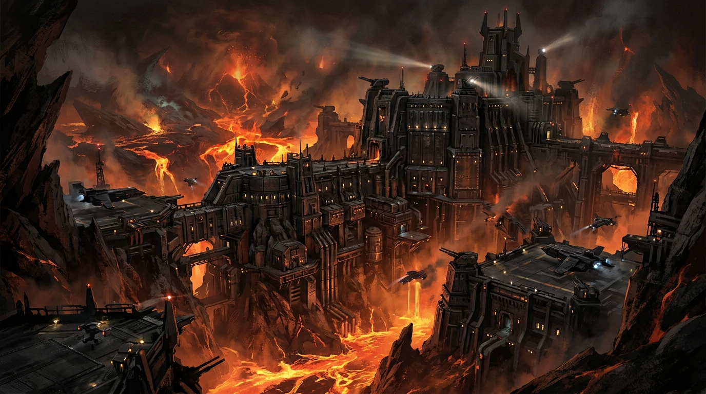

But Vaylen’s paranoia had not waned over the decades. The activation of the Nexus sent a ripple across the subspace network, a beacon that alerted the Iron Dominion. Kaylen was immediately thrust into a political web, hunted by Vaylen’s shadow-assassins. 

These fanatical operatives were the terror of the Reach. They piloted sleek stealth-ships that possessed no heat signatures, cloaking themselves in space to strike without warning. They did not fight with honor. The shadow-assassins utilized chemical warfare. They would breach the hulls of outposts and deploy boarding parties, slaughtering entire stations of innocents just to ensure they cornered Kaylen. His life became a flight through the stars, constantly scanning the shadows, and fighting skirmishes against killers in the corridors of deep-space waystations.

Yet, he was not alone. Whispers of his survival reached the Vanguard Remnant, loyalists who had spent twenty years in hiding. These scattered rebel cells had clung to the prophecy of the lost heir. But they were not dreamers; they were cynical survivors. When Kaylen finally made contact with the Remnant generals in a meeting on an acidic moon, they did not bow. They sneered.

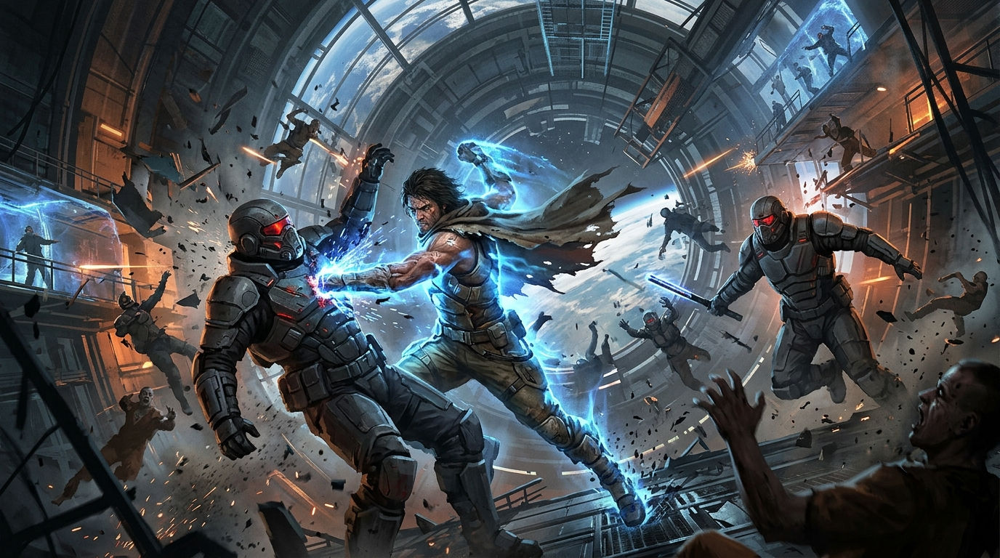

To them, he was a naive child who had played in the mud of a primitive world. He lacked the royal bearing, tactical acumen, and ruthlessness required to dismantle the Iron Dominion’s war machine. They viewed his survival as a fluke and his pendant as a stolen toy. They demanded a trial by fire, a demonstration of supremacy, before they would risk their remaining ships and lives for his cause.

The trial was a suicide mission: the liberation of the Kaylen-Tor Prison Colony. It was a fortress built into the core of a hyper-dense planetoid. It was here that the highest-ranking Vanguard generals—the tacticians of the old regime—were scheduled for execution. 

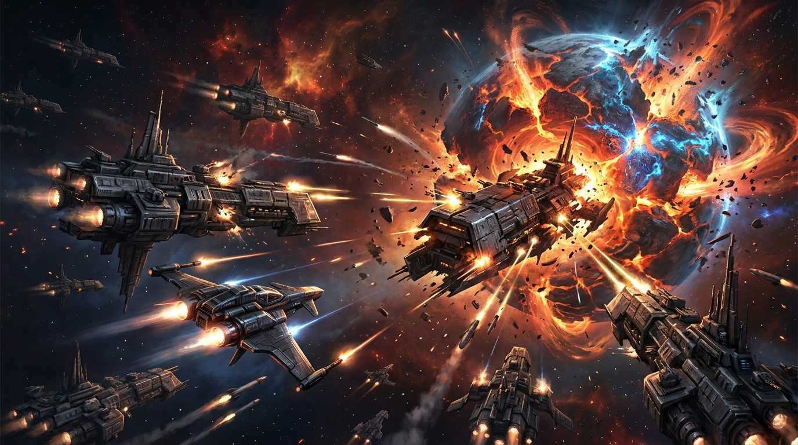

Kaylen didn't lead from a command deck. He led from the front. Engaging his Interceptor's phase-shifting armor, he dove into the orbital defense grid, weaving through a blizzard of dark-energy flak. He breached the colony’s outer hull, abandoning his ship to lead the boarding action personally.

In the zero-gravity environment of the prison's central rotunda, Kaylen fought hand-to-hand against elite Dominion guards. The combat was brutal and exhausting. He utilized every trick Elias had taught him in the Martian slums, combining it with the teleporting tech of the ancients. 

He fought with the desperation of a cornered animal and the fury of a wronged monarch. He ripped the executioner's blade from his hands, saving the loyalist generals seconds before their demise. Fleeing the colony, he engaged in a dogfight against overwhelming Dominion reinforcements. This was where his brilliance shone. 

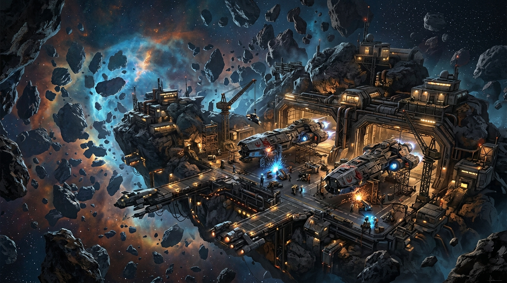

He didn't rely on brute force; he outsmarted the Dominion commanders. He baited their cruisers into the planetoid's gravity shears, watching their shields collapse under the sheer physics of the trap. He used the debris of destroyed ships as cover, orchestrating a ballet of destruction that left the Remnant fleet watching in awe.

He had proven himself not just as a survivor, but as a predator capable of hunting the Dominion. The skepticism of the Remnant generals evaporated, replaced by a burning loyalty. Slowly, the scattered rebel cells united under his banner. He shed the mercenary ships, replacing them with graceful Vanguard cruisers retrieved from hidden orbital caches. 

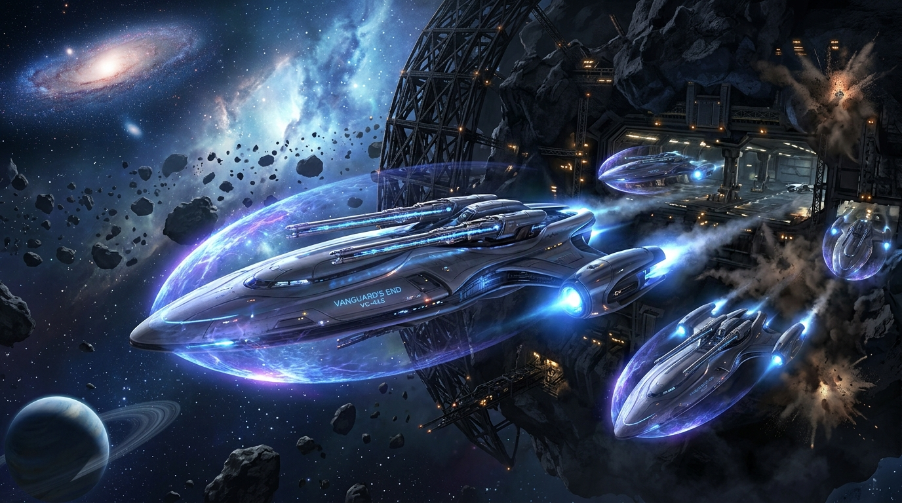

These sleek vessels shimmered with plasma-shield technology, beam weapons, and slipspace drives. Kaylen established a hidden base of operations in the heart of an asteroid field, surrounded by a masking nebula that rendered Dominion sensors blind. 

It was here, amidst the roar of engines and the clatter of munitions, that Kaylen formally took the mantle. He organized his forces, trained recruits into hardened soldiers, and prepared the Vanguard Remnant for an all-out war. The lost scion had returned, and the Sovereign was ready to reclaim the stars.

* **Themes/Gameplay:** Loyalist Faction, Prison Breaks, Shipyard Raids, Fleet Building

### ACT IV: THE DOMINION WAR
**All-Out Multi-System Warfare**

The mantle of Sovereign is not merely a title; it is a burden that transforms every facet of Kaylen's existence. Accepting his destiny, he realizes that guerrilla raids and scattered resistance will no longer suffice. The Vanguard Remnant must transition from an insurgency into a unified military force. To tear down the Iron Dominion, Kaylen launches a coordinated multi-system war across the interconnected wormhole networks, seeking to dismantle the tyrant Vaylen's dark-energy infrastructure.

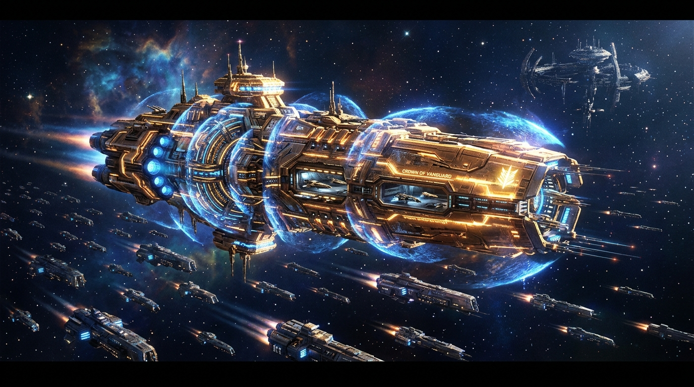

In this crucible of conflict, Kaylen undergoes an evolution from a dogfighter relying on instinct to a Fleet Commander burdened with the lives of millions. The transition is jarring. Where he once calculated trajectories and thruster output, he now evaluates casualty rates and the strategic viability of entire star systems. The cockpit of his Interceptor, once his entire universe, is exchanged for the command deck of his newly christened flagship, *The Crown of Vanguard*.

This dreadnought is a masterpiece of ancient Vanguard engineering, recovered from the deepest reaches of the Nexus graveyard. Its hull gleams with polished aurum-alloy, augmented with plasma-shield emitters and rows of heavy beam batteries. The heart of the ship—and the nerve center of the rebellion—is the holographic war room. 

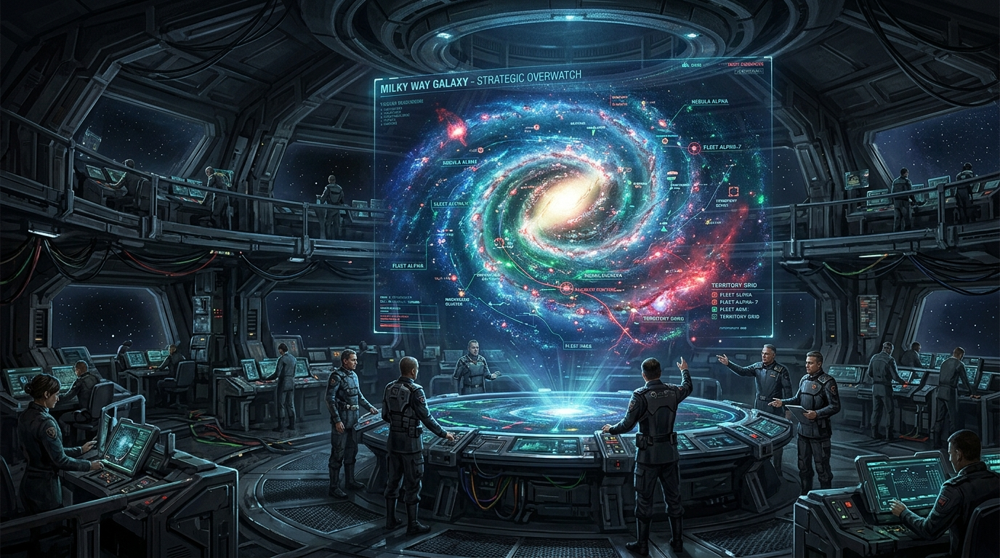

Stepping into the war room for the first time is a terrifying experience. The circular chamber is dominated by a floating projection of the Sovereign Reach, illuminated in shifting hues of sapphire, emerald, and crimson. Thousands of individual blips represent dreadnoughts, frigates, fighter squadrons, and supply convoys, all moving in real-time across the galactic map. This is his chessboard. The air thrums with the hum of quantum communication relays, processing petabytes of tactical data from across a dozen warzones. 

From his command dais, Kaylen issues tactical orders to armadas of plasma dreadnoughts, agile missile frigates, and swarms of strike fighters. With a wave of his hand, he directs fleet movements across lightyears, calculating slipspace jump coordinates and establishing overlapping fields of fire. He watches as lines of light intersect on the holo-map, representing the clash of thousands of ships. Every system he liberates brings him one step closer to Vanguard Prime, but every order he gives carries a tremendous weight in blood.

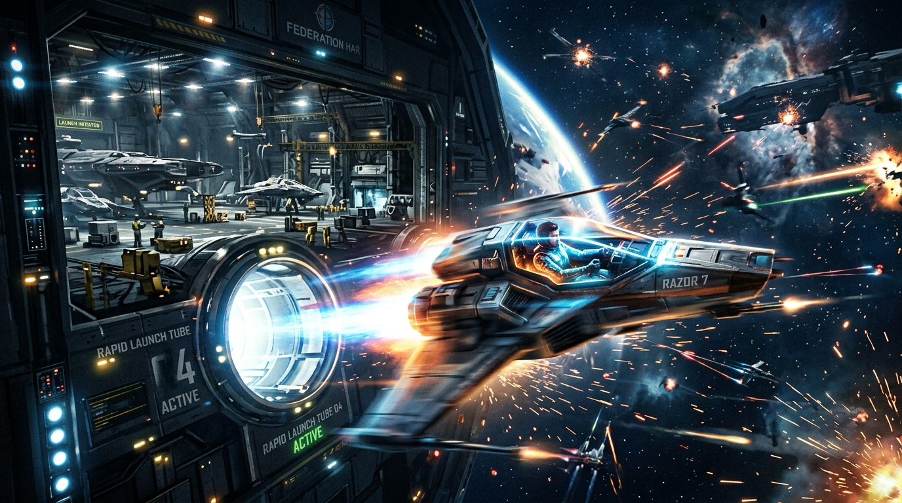

Yet, despite the grand scale of his new role, the soul of a pilot still burns within him. Kaylen refuses to be a commander who merely watches from the safety of a citadel. *The Crown of Vanguard* features a rapid-launch tube that allows him to jump into the cockpit of his modified Vanguard fighter. Mid-battle, when a flank begins to crumble or a crucial objective must be secured, he launches from the hangar bays, transitioning from macro-tactics to the visceral reality of deep-space combat.

The combat scale expands drastically, dwarfing the skirmishes of his mercenary days. Kaylen is thrust into fleet engagements that defy comprehension. He coordinates artillery strikes that streak through the void, manages shield walls that ripple with energy as they absorb Dominion salvos, and dives headlong through the crossfire of hundreds of warships. 

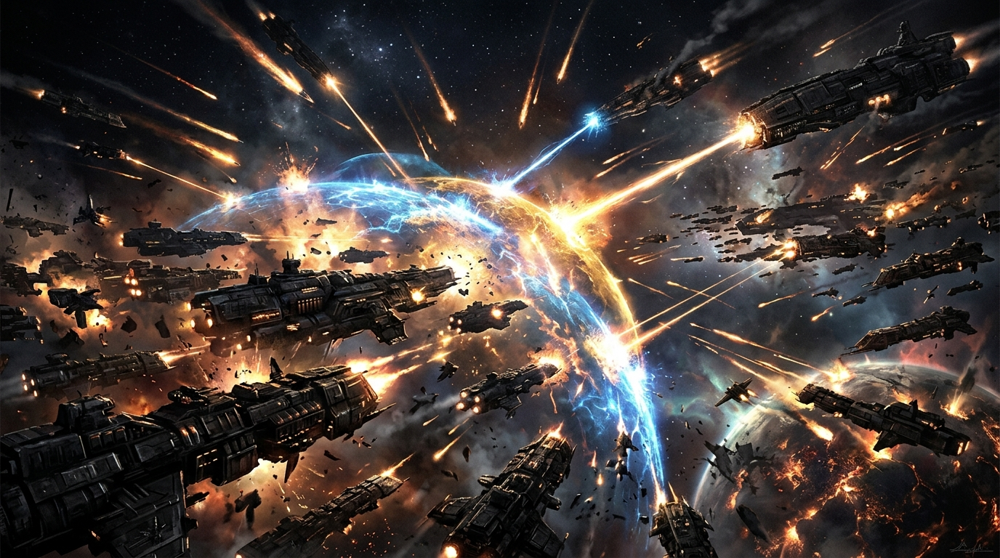

His Interceptor becomes a scalpel amidst a battle of sledgehammers. He weaves through debris fields composed of shattered cruisers, surgically taking out enemy shield generators, severing communication relays, and neutralizing anti-aircraft batteries to clear a path for his capital ships. The juxtaposition of sitting in the war room and then feeling the roar of his own thrusters creates a frantic tempo to the war.

The Iron Dominion is not slow to react. Regent Vaylen, terrified of the unifying symbol of the Vanguard heir and realizing the magnitude of the threat Kaylen poses to his regime, unleashes the true horror of his arsenal. To crush the rebellion, he deploys the 'Planet-Crackers'—moon-sized dreadnoughts fueled by volatile dark matter. 

The first time one of these monstrosities drops out of slipspace, the gravitational displacement causes local space to warp. They are brutalist spheres of black metal and glowing crimson fissures, looking like dying stars encased in armor. They possess the capability to shatter continental plates and boil oceans in minutes, rendering entire worlds into molten slag. 

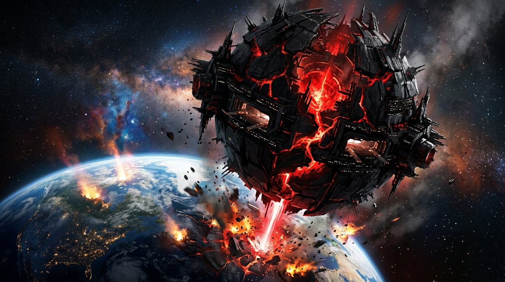

The arrival of a Planet-Cracker in a system changes the stakes entirely. A tactical engagement instantly devolves into a chaotic race against time. Kaylen is forced to split his attention between crippling the superweapon and organizing the evacuation of civilians from the doomed world below. He listens to the panicked pleas of planetary governors begging for salvation over the comms, a cacophony of terror that haunts his rare moments of sleep.

He must strategically manage his fleet's resources, making command decisions on a galactic scale. He must decide which systems to liberate to gain vital resources, plasma fuel, and strategic footholds, and which allied worlds must be sacrificed to stall the Dominion's advance. There are moments when he sits in his command chair, knuckles white as he grips the armrests, and orders his fleets to retreat, knowing that the world below—and everyone on it—will be reduced to ash. 

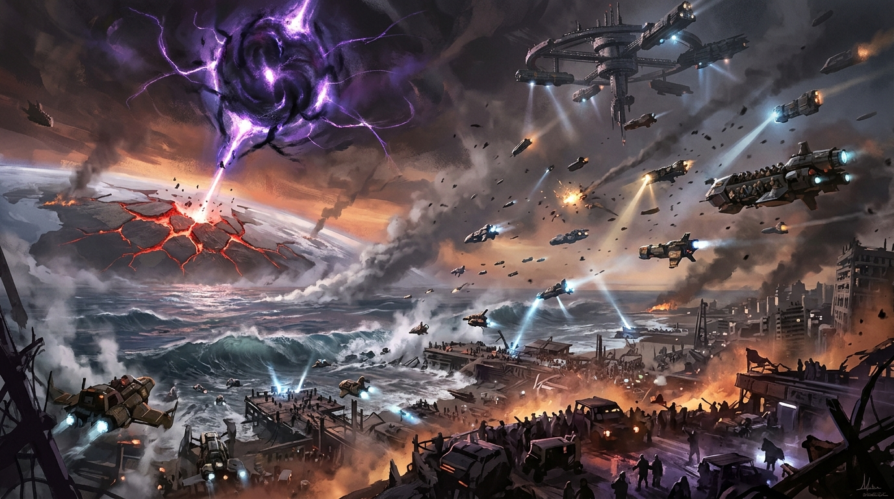

Every victory unlocks new sectors, shipyard upgrades, and allied factions flocking to his banner, but it also escalates the Dominion's system-burning retaliation. Entire planets are reduced to glowing glass as Vaylen's desperation grows. The psychological toll of command weighs heavily upon him. Kaylen is no longer just fighting for his own life or the survival of his small mercenary crew; he is fighting for the existence of billions of innocent souls.

The war is not without its personal tragedies. It forces Kaylen to make heart-wrenching sacrifices, and the cost of leadership is paid in the lives of those he loves. Members of his original scavenger crew—the misfits who pulled him from the void and became his family—fall in battle defending critical supply lines and evacuation transports. 

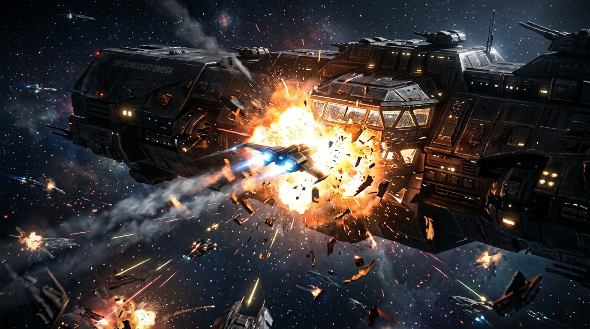

The losses are devastating. Jax, his cynical cyber-warfare specialist, meets his end when his stealth-ship is caught in a warp-core breach during a daring hacking operation on a Dominion central server. His final transmission is a sarcastic joke, cutting off into static as his ship vaporizes. Kayl, the alien weapons expert, holds the line alone in a breached hangar bay, manually firing a cannon to cover a civilian retreat until he is overwhelmed by a swarm of Dominion shock troops.

Most painful of all is the loss of Lyra. Seeking redemption for the atrocities she committed under Vaylen's banner, she makes the ultimate sacrifice during an engagement over a populated refugee world. When a Dominion cruiser locks its dark-energy weapons onto a defenseless civilian transport, Lyra overloads her own reactor and rams her Interceptor directly into the cruiser's bridge. The resulting explosion saves millions, but leaves an aching void in Kaylen's heart. He watches her transponder signal vanish from the tactical holo-map, a testament to the true cost of this war.

Through these agonizing losses, the Vanguard loyalists must learn to adapt. They are forced to abandon their ancient chivalric codes and fight dirty. Under Kaylen's command, they employ ambushes, systemic sabotage, and guerrilla tactics to survive the attrition of the Dominion war machine. He learns to fight like a mercenary on a galactic scale.

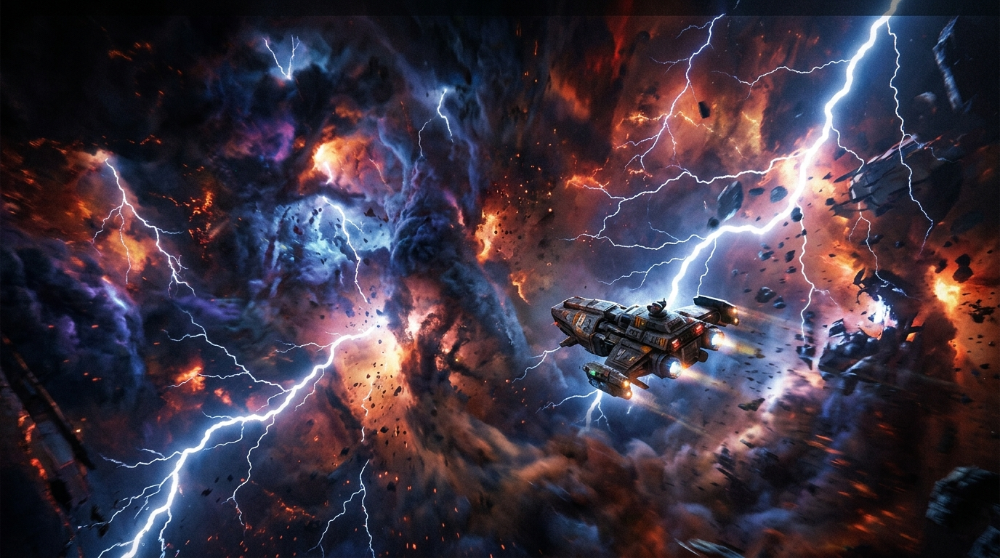

The escalating conflict culminates in a siege on the Dominion's primary dark-energy foundry—the fortified heart of Vaylen's war machine. This colossal installation is located deep within the center of a dense nebula known as the Abyssal Veil. The environment itself is a deadly enemy; the swirling plasma storms scramble targeting sensors, drain deflector shields, and tear unshielded hulls apart.

The siege is a nightmare. The armada must navigate through blinding plasma storms, constantly bombarded by hidden Dominion defense platforms and asteroid collisions. Communication is reduced to static, forcing fleet captains to rely on visual signals and pre-planned maneuvers. Kaylen leads the vanguard in his Interceptor, weaving through bolts of lightning to clear a path for his heavy bombers.

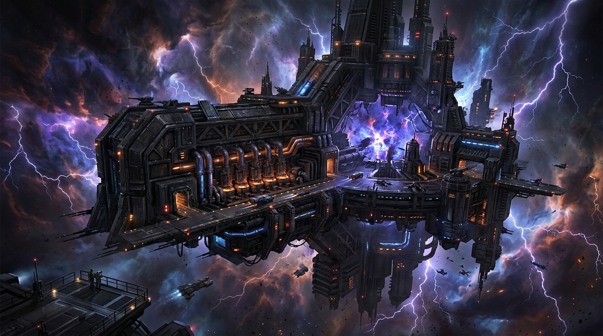

The battle is a melee in the dark. Capital ships collide in the thick nebula gas, their weapons firing blindly at point-blank range. Kaylen engages in dogfights where the only illumination comes from the flash of plasma cannons and the explosions of dying ships. 

Through sheer determination and casualties, Kaylen successfully breaches the foundry's outer defenses. He navigates his fighter through a trench run along the facility's super-structure, dodging automated turrets and venting plasma exhaust. In a climax, he disables the foundry's main core with a surgical dark-matter torpedo strike. 

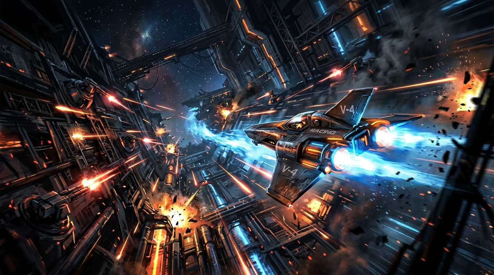

The resulting chain reaction is apocalyptic. The foundry collapses in a blinding supernova of dark energy that briefly outshines the entire nebula. The shockwave tosses dreadnoughts like toys, but the mission is a success. Kaylen has crippled Vaylen's fleet production capabilities and destroyed his primary source of dark matter.

However, it is a pyrrhic victory. Kaylen leaves the Abyssal Veil with his armada battered, limping back to friendly space. His shipyards are overflowing with damaged vessels, and his crew rosters are decimated. The fleet is depleted, running on fumes and willpower for the final push. Yet, as the echoes of the foundry's destruction ripple across the subspace network, it signals to the entire galaxy that the Iron Dominion is vulnerable. The path to Vanguard Prime is open, setting the stage for the reckoning.

* **Themes/Gameplay:** Capital Ship Battles, Fleet Command, Tactical Map, Superweapons, Heavy Casualties, Nebula Combat

### ACT V: SOVEREIGN'S RECKONING
**The Battle for the Homeworld**

With the Iron Dominion’s supply chains severed and their planet-cracking superweapons reduced to slag in the outer sectors, the path to the Vanguard homeworld finally lay open. The campaign, which had exacted a bloody toll on the united armada, was about to culminate in the heart of the enemy’s power. Kaylen stands on the bridge of *The Crown of Vanguard*, gazing out through the main viewport as his fleet drops out of slipspace. Before him hangs Vanguard Prime—the jewel of the galaxy, the stolen cradle of his ancestors, and the throne he was born to reclaim. 

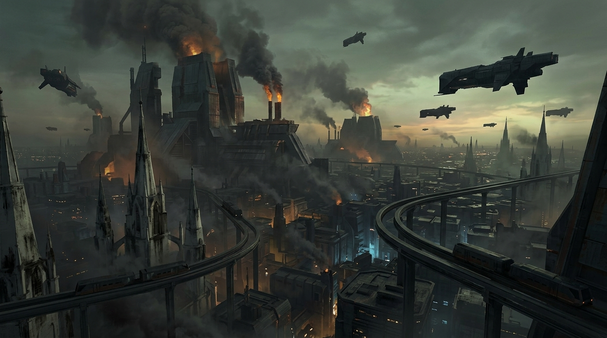

Vanguard Prime is a continent-spanning ecumenopolis, a world entirely swallowed by a vast city. In its golden age, it had been a beacon of art, culture, and enlightened governance, its skies dominated by soaring alabaster spires, suspended monorails, and bioluminescent hanging gardens that breathed life into the steel canyons. Now, however, the planet bears the scars of two decades of Dominion occupation. 

Under Regent Vaylen’s brutal martial law, the skies have been choked with industrial smog, casting a sickly twilight over the world. The gardens are dead, replaced by foundries that vomit toxic ash into the atmosphere. Angular Dominion patrol ships drift like carrion birds through the clouds, strictly enforcing planetary curfews with automated sniper batteries and sensory sweepers. The oceans have been dammed and siphoned to cool the dark-matter reactors that power Vaylen’s military machine. 

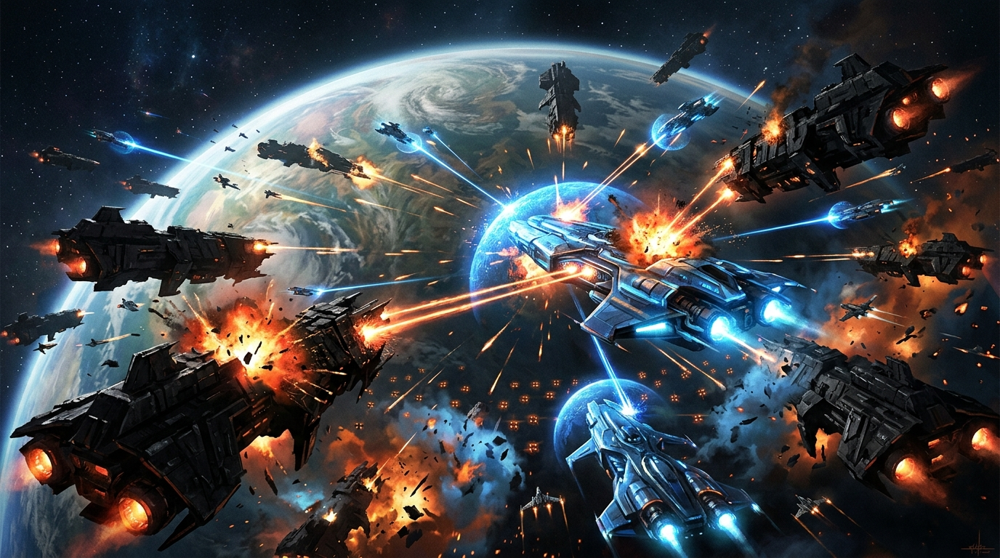

A planetary blockade encircles the ecumenopolis—a suffocating ring of jagged dreadnoughts, fortified minefields, and orbital weapon platforms bristling with plasma cannons. It is the largest defensive grid Kaylen has ever faced, a testament to the desperation of a crumbling regime. Vaylen has pulled every remaining loyalist ship back to the homeworld, fortifying his position for a final stand. 

Within his personal command fortress—a citadel of black iron that pierces the smog layer and anchors the primary ancient gate network in orbit—Regent Vaylen has descended into madness. Realizing his grip on the sector is slipping and that the "Lost Scion" has come to exact vengeance, Vaylen abandons any pretense of tactical retreat. Driven by a volatile mix of paranoia, malice, and wounded pride, he powers up the precursor ring suspended above his citadel. 

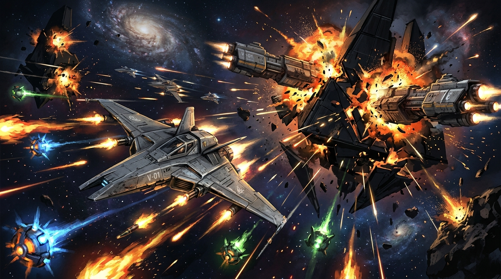

He broadcasts a sector-wide transmission, his scarred face filling the hololithic displays of every ship in the fleet. Vaylen’s intention is not to flee. Instead, he plans to launch his vanguard armada directly into the Sol System. He knows Kaylen's true identity, knows of his upbringing on the fringes of Mars, and knows he still harbors love for humanity and his adoptive father, Elias. As his ultimate act of revenge, Vaylen intends to enslave Earth and burn it to glass, forcing Kaylen to watch his past be eradicated before destroying his future.

The ticking clock forces Kaylen's hand. He orders the fleet to advance. An all-out assault is launched against the planetary defense grid. The vacuum of space erupts into a maylstrom of blinding lasers, shattering shields, and expanding clouds of vaporized metal. Thousands of swift fighters clash in a swirling dance between the lumbering dreadnoughts. 

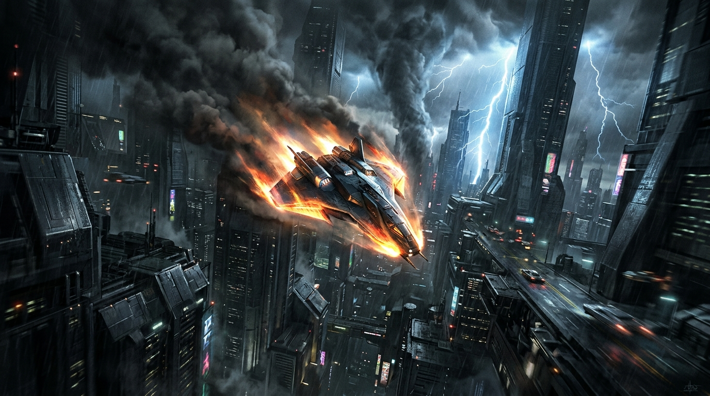

Kaylen dives into the fray in his custom Interceptor, leading the assault. He navigates the minefields, weaving through the overlapping fields of fire that sweep across the void like scythes. His remaining Vanguard loyalists—those hardened captains who once doubted him—now sacrifice themselves willingly to carve a path for him. Heavy cruisers absorb broadsides, ramming Dominion defense platforms to create a corridor through the blockade. 

With the orbital defenses temporarily fractured, Kaylen plunges his fighter into the smog-choked atmosphere of Vanguard Prime. Friction burns across his energy shields as he breaks through the cloud cover, plunging into the metallic canyons of the ecumenopolis. The heat of the bombardment and the scale of the conflict generate atmospheric storms. Lightning arcs between the skyscrapers, illuminating the wet durasteel of the city.

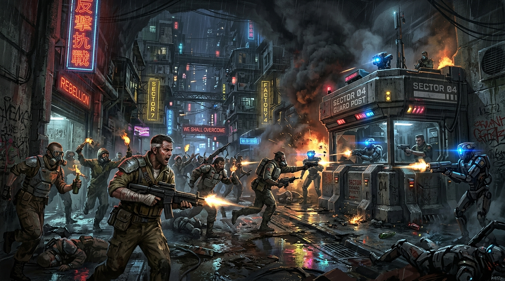

Down in the subterranean levels and the crowded habitation blocks, the citizens of Vanguard Prime look up to the sky. For twenty years, they have lived under the heel of the Dominion, their hope ground into dust. But as they see the graceful silhouettes of Vanguard fighters tearing through the clouds, painted in the forgotten colors of their rightful rulers, a spark ignites into an inferno. 

A bloody revolt erupts in the streets below. Factory workers throw down their tools and take up blasters, storming the guard posts. Civilians use explosives to cripple Dominion patrol transports. The city becomes a warzone. Plumes of smoke rise from the lower levels as the oppressed masses fight back, matching the dogfights raging in the skies above.

Kaylen pushes his ship to its limit, tearing through the skies toward Vaylen’s citadel. Dominion interceptors swarm him, but he outmaneuver them, using the architecture of the city to his advantage. He performs high-G turns around suspended transit tubes, threading the needle through the narrow gaps between residential spires, leaving his pursuers to crash in explosions against the concrete. 

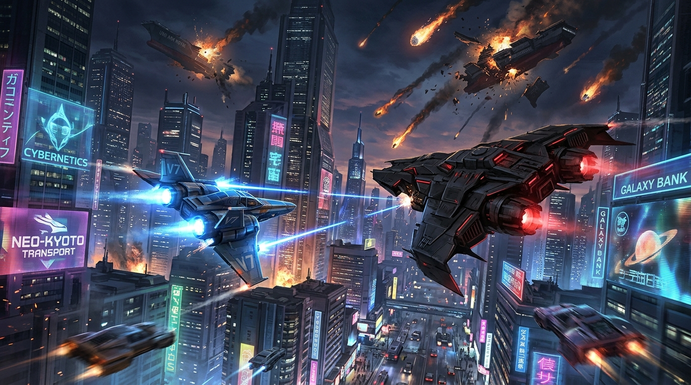

Finally, he breaches the shields of the command fortress. Rather than cowering in his throne room, Vaylen takes to the sky. The hangar doors of the citadel grind open, and the Regent launches in a modified prototype dread-fighter. It is a monstrous machine, black as the void, equipped with stolen ancient technology that mirrors Kaylen's own. 

The final showdown commences—a brutal dogfight through the skyscrapers and neon-lit canyons of the capital. It is a battle of equals, pushing the limits of Kaylen's piloting skills, his crew’s engineering tweaks, and the mysterious ancient technology he wields. 

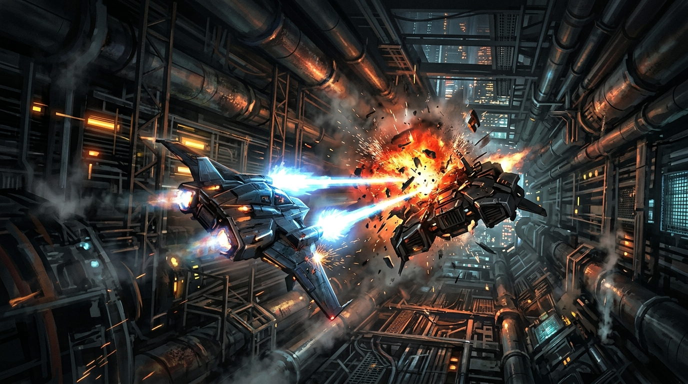

Vaylen matches Kaylen's teleportation blinks blow for blow. As Kaylen warps behind him to lock on with plasma cannons, Vaylen phases out of reality, reappearing above him to unleash a barrage of dark-matter torpedoes. Kaylen dives sharply, the torpedoes missing him by inches and striking a glowing billboard, sending glass and sparking conduit raining down into the streets below.

The chase is relentless, a display of speed and precision. Kaylen weaves through collapsing transit bridges and dodges the falling debris of crippled capital ships plummeting from orbit. The neon lights of the city streak past his canopy in a blur of color as he and Vaylen trade blows. Vaylen's dark-energy beams scorch his hull, while Kaylen's phase-shifting armor barely keeps him from being vaporized. 

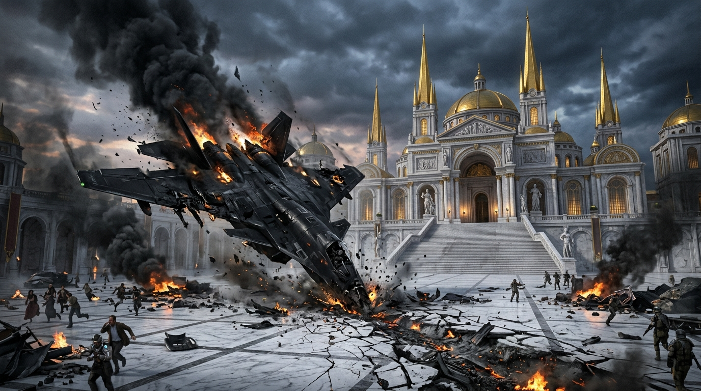

Realizing that conventional tactics will not break the stalemate, Kaylen taps into the lessons Elias taught him in the rust-stained garages of Mars. He purposefully flies into a narrow industrial shaft, goading Vaylen to follow. As Vaylen enters the confined space, Kaylen abruptly cuts his main thrusters, flips his fighter 180 degrees using auxiliary maneuvering jets, and unleashes a concentrated barrage of plasma fire directly into Vaylen's unshielded exhaust ports.

The explosion is blinding. Vaylen’s prototype fighter loses power, its engines dying. Kaylen watches as the crippled ship plummets from the sky, trailing black smoke, and crashes into the central plaza of the capital, skidding to a halt before the steps of the Vanguard palace.

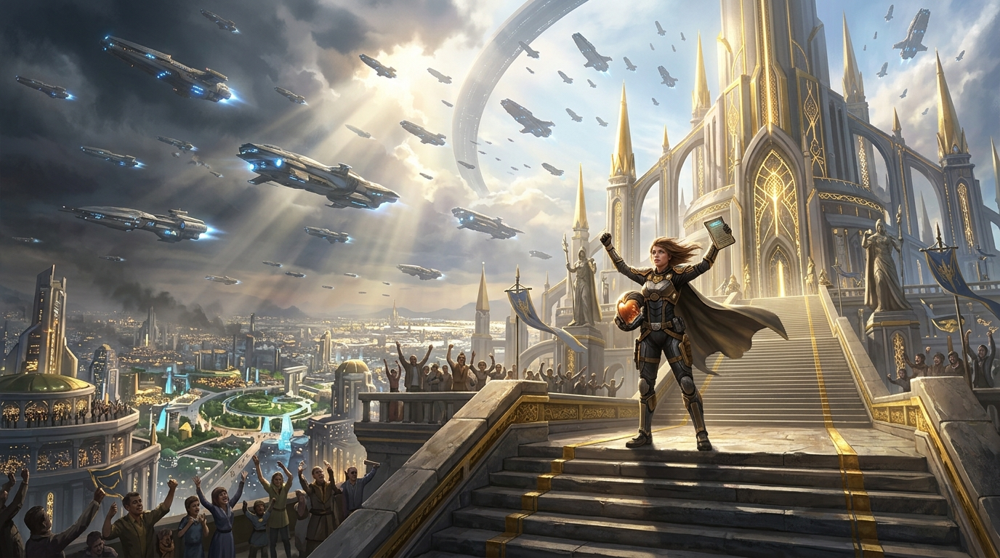

Kaylen lands his battered Interceptor in the plaza, the heat of his thrusters distorting the air. Stepping out of the cockpit, he draws his sidearm and approaches the smoking wreckage. Vaylen, bloodied and broken, drags himself from the cockpit. The tyrant who slaughtered Kaylen's family, who oppressed a galaxy, finally meets his end by the hand of the child he failed to kill. Kaylen executes him, formally ending the Iron Dominion’s reign of terror. 

With Vaylen dead and his command structure shattered, the remaining Dominion forces surrender. Kaylen swiftly moves to the citadel's command center and permanently shuts down the Sol gate, severing the connection and saving Earth from the intended genocide. The battle is won. 

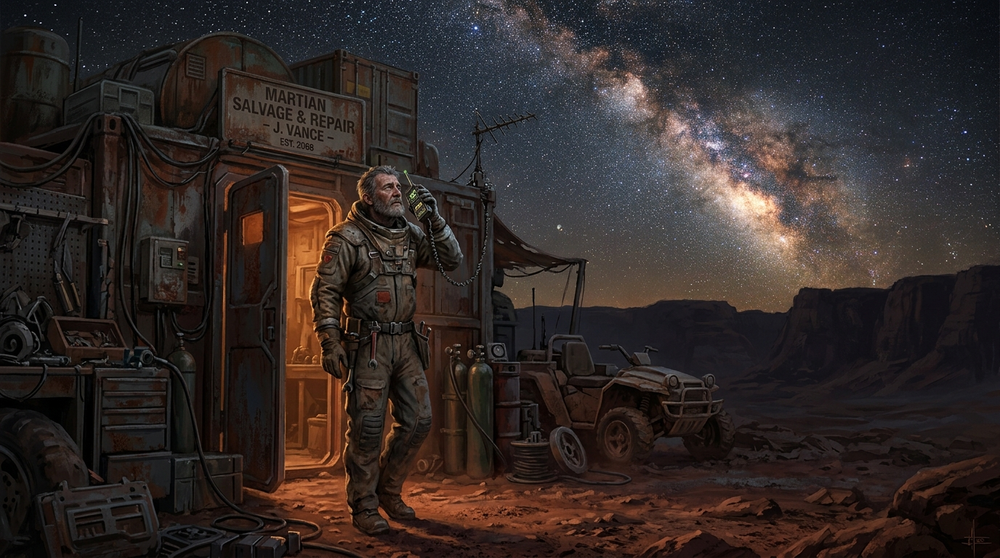

The story concludes with a cinematic sequence. The smog begins to clear from the skies of Vanguard Prime as planetary atmospheric scrubbers are brought back online. Sunlight pierces the clouds, illuminating the golden spires once more. Kaylen slowly ascends the steps of the grand palace, stepping into the sunlit throne room to the cheers of his victorious fleet and a liberated planet. He has finally connected his past as an Earth cadet with his destiny, taking his rightful place as the Sovereign of a new era.

In a post-credits scene, the camera pans across the red landscape of Mars. Elias stands outside his garage, looking up at the glittering night sky. The quiet of the Martian night is broken by the sudden crackle of his comm-radio. Through interference and cosmic radiation, a garbled transmission finally breaks through. It’s Kaylen's voice, letting the old man know that his boy didn't just survive the impossible—he made it home.

* **Themes/Gameplay:** Massive War Operations, Boss Dogfight, Planetary Assault, Final Sovereign Showdown

---

## ⚔️ Key Factions

### Earth Defense Force (EDF)
* **Description:** Utilitarian human fleet with heavy railguns and armored plating.

### House Vanguard (Loyalist Remnants)
* **Description:** High-tech plasma-shielded cruisers and swift wing fighters awaiting their true sovereign.

### The Iron Dominion (Usurpers)
* **Description:** Military junta utilizing dark energy armaments and giant dreadnoughts.

---

## 🚀 Core Gameplay Mechanics Matrix
* **6-DOF Dogfighting:** High-speed maneuvering, kinetic/beam weapons, energy distribution (Shields vs Engines vs Blasters).
* **Wormhole Highway System:** Fast-travel chokepoints that can be ambushed, explored, or stabilized. Unstable wormholes contain mini-bosses & ancient artifacts.
* **Small Ships vs Big Ships:** Play in nimble strike fighters or board/command colossal Titan Dreadnoughts with turrets & strike bays.
* **Dynamic Mission Generator:** Patrol, Escort, Recon, Base Siege, Bounty Hunting, Ancient Salvage.
